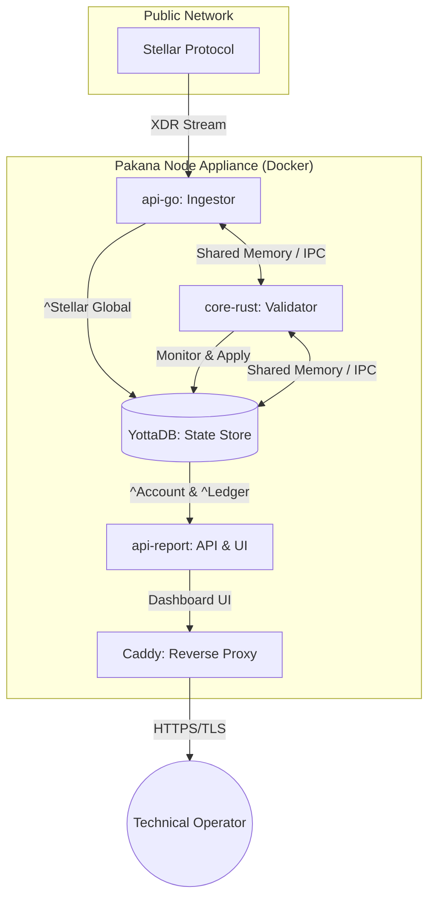

# Project Pakana: The Sovereign Node Appliance (v1.1.0 Community Edition)

### "A Hardened Virtual Appliance for 21st Century sovereign Commerce"

## 1. Executive Summary

Project Pakana is a decentralized infrastructure initiative designed to bridge the gap between **Real World Assets (RWA)**, **DeFi**, and **Legal Compliance**. The "Pakana Node" is a sovereign, containerized virtual appliance that allows organizations to act as their own bank, notary, and record keeper.

By combining the speed of **YottaDB** (Hierarchical NoSQL), the safety of **Rust**, and the ubiquity of the **Stellar Network**, the Pakana Node creates a **"Meta-Network"**—a private, high-performance logical layer on top of the public blockchain that enforces **UCC Article 12** compliance for digital assets.

## 2. The "Appliance-First" Mission

Pakana is built as an **Idempotent Appliance**. Every deployment, update, and migration is automated via `sudo bash ./deploy_pakana.sh`. 

### Key Design Pillars:
*   **Performance-Centric**: Mandatory use of `ipc: host` across Docker services for in-process memory speeds between Go, Rust, and YottaDB.
*   **Aesthetic Excellence**: A premium, "Cyberpunk" dashboard featuring glassmorphism, neon accents, and brilliant readability for real-time operations.
*   **One-Command Deployment**: Infrastructure (Azure Bicep), DNS (Namecheap API), and Software (Docker Compose) are handled in a single, hardened workflow.

## 3. Core Architecture & Stack

The node acts as a **Sovereign Indexer** and **Validation Anchor**, maintaining a local, private state synchronized with the public Stellar ledger.



### Technical Stack
- **Database**: YottaDB (Persistent Hierarchical NoSQL) + Octo (SQL Projection).
- **Ingestion**: Go (CGo bindings for YottaDB Go v2.0.1).
- **Validation**: Rust (High-speed XDR decoding and state transition logic).
- **UI**: React (Cyberpunk Theme, Vite, Tailwind CSS).
- **DNS/SSL**: Namecheap API + Caddy (Automatic Let's Encrypt).

## 4. Current State (v1.1.0 - Hardened) 🚀

- [x] **Hardened Ingestion**: Atomic YottaDB Transaction Processing (TP) across Go and Rust services.
- [x] **Cyberpunk Dashboard**: Sleek, futuristic UI with real-time digital clock and status monitoring.
- [x] **Contextual Tooltips**: On-hover technical descriptions for all major UI components (Card/Badge).
- [x] **DNS Automation**: Integrated Namecheap API for safe "Read-Merge-Write" 'A' record updates.
- [x] **Component Architecture**: Standardized `data-component-id` tagging for advanced observability.
- [x] **XDR decoding**: Full Protocol 24 support in `core-rust` for asset and sequence tracking.
- [x] **Operational Continuity**: Shared memory (`ipc: host`) architecture verified for high-concurrency.

## 5. Deployment Instructions

**Prerequisites**: [Azure CLI](https://learn.microsoft.com/en-us/cli/azure/install-azure-cli) installed and logged in.

### One-Command Setup:

1.  **Clone this repository**:
    ```bash
    git clone https://github.com/lockb0x-llc/pakana-node-ce.git
    cd pakana-node-ce
    ```

2.  **Execute Apprentice Deployment**:
    ```bash
    bash ./deploy_pakana.sh
    ```
    
    The script will prompt you for:
    - **Azure Credentials**: Subscription and Resource Group.
    - **Namecheap API Access**: Automatically points your domain (e.g., `build.lockb0x.dev`) to the new VM IP with strict validation before applying changes.
    - **Software Branch**: Deploy from `main` or a specific feature branch.

3.  **Access Your Appliance**:
    The script will output the VM IP, Hostname, and a direct link to your **Cyberpunk Dashboard**.
    Default: `https://<your-domain>`

## 6. Development & Observability

### Component ID System
Every UI element is tagged with a `data-component-id` (e.g., `Card-LatestLedger`, `Badge-IngestionStatus`). This allows developers to use browser dev tools or automated testing suites to identify and debug specific ui components instantly.

### Technical Tooltips
Hover over any status badge or metrics card on the dashboard to see exactly what is happening in the engine (e.g., "M-based direct access via CGo" or "YottaDB IPC persistence layer").

## 7. Security & Operations

### Network Strategy
- **Port Masking**: YottaDB and SQL ports are bound to `127.0.0.1`. Use SSH Tunnels for database access.
- **Automatic SSL**: Caddy handles all TLS termination. Port `80` is automatically upgraded to `443`.
- **DNS Safety**: The Namecheap automation verifies your current DNS snapshot before making any modifications, preventing accidental data loss in your production domain.

### Infrastructure (Azure Standard_F2s_v2)
- **Data Disk**: 256GB Premium SSD v2 mounted at `/data` with `noatime`.
- **Docker Home**: All container data (including volumes) resides on the high-speed NVMe/SSD partition.

## 8. Querying Data via SQL

Access the node's state via **Octo** (SQL Layer):

```sql
-- DBeaver Connection: localhost:9080 (via SSH Tunnel)
SELECT * FROM ledgers ORDER BY sequence DESC LIMIT 10;
```

---

*Part of the Lockb0x Sovereign Infrastructure Initiative.*

## 9. Project Structure & Component Documentation

Detailed documentation for each microservice is available in its respective directory:

| Component | Description | Tech Stack | Documentation |
| :--- | :--- | :--- | :--- |
| **[api-go](./api-go/README.md)** | **Network Sentinel** | Go 1.24 | [Ingestor Guide](./api-go/README.md) |
| **[core-rust](./core-rust/README.md)** | **The Validator** | Rust | [Validator Guide](./core-rust/README.md) |
| **[api-report](./api-report/README.md)** | **Executive Dashboard** | Go/React | [API & UI Guide](./api-report/README.md) |
| **[deploy](./deploy/README.md)** | **Infrastructure** | Bicep/Bash | [Appliance Guide](./deploy/README.md) |

### File Layout
```
.
├── api-go/             # Go ingestor service
├── core-rust/          # Rust processor service
├── api-report/         # Reporting API service
│   └── dashboard/      # React frontend (Vite)
├── deploy/             # Infrastructure (Bicep & Automation)
├── docs/               # Architecture & Visual Assets (Videos)
├── init.sql            # Octo SQL DDL
├── docker-compose.yml  # Multi-service orchestration
└── deploy_pakana.sh    # Unified Appliance Deployment Entrypoint
```

## 10. Multimedia Resources

We provide visual aids to help understand the concepts:
*   **[Deployment Analysis](./docs/deployment-analysis.html)**: Interactive report on the deployment process.
*   **[Video Assets](./docs/assets/)**: Visualizations of the Go/Rust/YottaDB architecture.