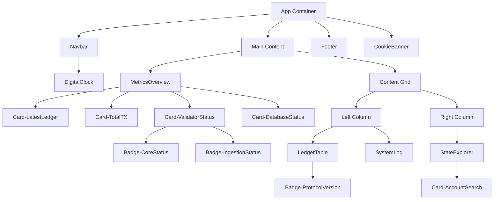

# Dashboard Component Architecture

This document maps the visual components of the dashboard to their injected `data-component-id` attributes. This infrastructure enables agentic tools to precisely identify and target UI elements.

## Visualization
The dashboard includes an embedded diagnostic mode that mirrors the standard view but adds hover-based component identification.

**To enable:** Append `?debug=true` to the URL.
*   Example: `http://localhost:8080/?debug=true`

**Behavior:**
*   The `body` element receives the `.debug-mode` class.
*   Hovering over any instrumented component reveals its ID via a debug overlay.
*   A log entry "Diagnostic Mode Enabled" is added to the System Log.

## Component ID Reference

| Component File | ID Attribute | Description |
| :--- | :--- | :--- |
| `Navbar.tsx` | `Navbar` | Top navigation bar containing status and clock. |
| `DigitalClock.tsx` | `DigitalClock` | Displays the current server time (UTC/Local). |
| `MetricsOverview.tsx` | `MetricsOverview` | Grid showing high-level stats. |
| `Card.tsx` | `Card-{dataId}` | Contextual glassmorphism container (e.g., `Card-LatestLedger`). |
| `TransactionSparkline.tsx` | `TransactionSparkline` | SVG sparkline chart for transaction volume. |
| `Badge.tsx` | `Badge-{dataId}` | Contextual status indicators (e.g., `Badge-CoreStatus`). |
| `LedgerTable.tsx` | `LedgerTable` | The live scrolling list of recent ledgers. |
| `SystemLog.tsx` | `SystemLog` | Terminal-like log viewer for system events. |
| `StateExplorer.tsx` | `StateExplorer` | Search interface for querying Account/Transaction state. |
| `Footer.tsx` | `Footer` | Page footer with links. |
| `CookieBanner.tsx` | `CookieBanner` | Consent banner for analytics. |

## Usage for Agents
To target a specific component for modification or analysis:
1. **Identify**: Hover over the UI element to see its `data-component-id`.
2. **Locate**: Find the matching file in `src/components/{ID}.tsx`.
3. **Edit**: Apply changes to the component file.
