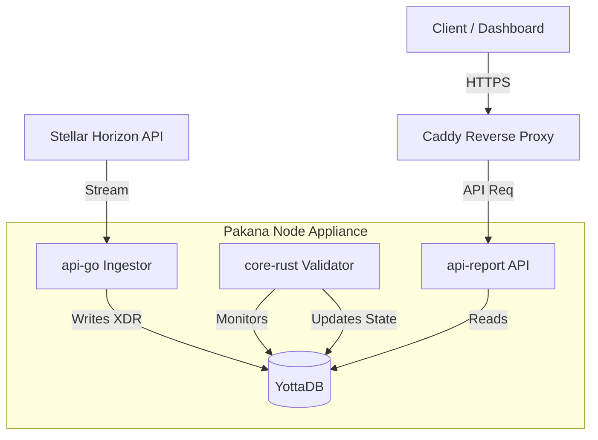

# System Architecture

## 1. High-Level Design

The Pakana Node is designed as a **Sovereign Appliance**—a self-contained, high-performance system that bridges the connection between the public Stellar Network and a private, optimized local state store.

## 2. Core Services

### A. The Ingestor (`api-go`)
*   **Purpose**: To serve as the "Network Sentinel."
*   **Technology**: Go (Golang) + CGo + Stellar SDK.
*   **Responsibility**:
    *   Connects to the Stellar Horizon API (Testnet/Mainnet).
    *   Maintains a cursor to ensure atomic, gap-less ingestion of ledgers.
    *   Writes raw XDR data directly to YottaDB globals (`^Stellar`) without processing logic, maximizing throughput.

### B. The Validator (`core-rust`)
*   **Purpose**: To enforce business logic and transition state.
*   **Technology**: Rust + `stellar-xdr` + `yottadb` crate.
*   **Responsibility**:
    *   Watches the `^Stellar` global for new ledger entries.
    *   Decodes the XDR envelopes.
    *   Verifies cryptographic signatures and transaction validity.
    *   Updates derived knowledge in `^Account` (e.g., Balances, Trustlines, Signers).

### C. The Storage Layer (YottaDB)
*   **Purpose**: High-speed hierarchical persistence.
*   **Technology**: YottaDB r2.03 (NoSQL) + Octo (SQL Projection).
*   **Architecture**:
    *   **Shared Memory**: Uses `ipc: host` to allow Go and Rust services to access the database directly in memory, bypassing network overhead.
    *   **Hierarchical Keys**: Data is stored in trees (`^Stellar("ledger", 12345)`), effectively acting as a pre-sorted index, allowing for O(1) or O(log N) retrieval speeds that outperform traditional RDBMS joins.

## 3. Data Flow Pattern: "The Steel Thread"
1.  **Ingest**: `api-go` receives a Ledger Close event. It writes the Ledger Header and Transaction Envelopes to YottaDB.
2.  **Signal**: The update to the global variable acts as a signal to watchers.
3.  **React**: `core-rust` (running a tight poll loop) detects the change.
4.  **Process**: It decodes the transactions, applies them to the local state (e.g., deducting 100 XLM from Account A, adding to Account B).
5.  **Serve**: A user queries `GET /api/v1/accounts/A`. The `api-report` service reads the final state from YottaDB and returns JSON.

## 4. Sparse History Strategy (Planned)
To maintain a small footprint, the Node is designed to implement a **Sparse History** pattern:
*   Instead of storing the entire blockchain history (Terabytes), the node will filter ingestion to only track accounts and assets relevant to the operator.
*   It serves as a "Partial Replica" of the network state, authoritative only for the scoped entities it watches.
